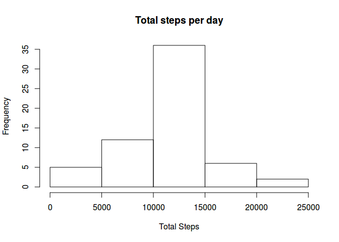

# Reproducible Research: Peer Assessment 1

Load packages

```r
library(dplyr)
```

```
## 
## Attaching package: 'dplyr'
## 
## The following objects are masked from 'package:stats':
## 
##     filter, lag
## 
## The following objects are masked from 'package:base':
## 
##     intersect, setdiff, setequal, union
```

```r
library(ggplot2)
```

## Loading and preprocessing the data

Read the data.


```r
activitydata <-read.csv("data/activity.csv", header = TRUE, na.strings = "NA")
summary(activitydata)
```

```
##      steps                date          interval     
##  Min.   :  0.00   2012-10-01:  288   Min.   :   0.0  
##  1st Qu.:  0.00   2012-10-02:  288   1st Qu.: 588.8  
##  Median :  0.00   2012-10-03:  288   Median :1177.5  
##  Mean   : 37.38   2012-10-04:  288   Mean   :1177.5  
##  3rd Qu.: 12.00   2012-10-05:  288   3rd Qu.:1766.2  
##  Max.   :806.00   2012-10-06:  288   Max.   :2355.0  
##  NA's   :2304     (Other)   :15840
```

```r
str(activitydata)
```

```
## 'data.frame':	17568 obs. of  3 variables:
##  $ steps   : int  NA NA NA NA NA NA NA NA NA NA ...
##  $ date    : Factor w/ 61 levels "2012-10-01","2012-10-02",..: 1 1 1 1 1 1 1 1 1 1 ...
##  $ interval: int  0 5 10 15 20 25 30 35 40 45 ...
```

Transform the interval column to represent the hours of the day in decimal format.


```r
activitydata <- mutate(activitydata, interval = (
                         as.integer(interval / 100) + 
                         (interval  %% 100)/60) 
                       )
```

## What is mean total number of steps taken per day?

##### Calculate the total number of steps taken per day

Load dpylr package. Then group by date, sum all the steps per each day and
finally calculate the mean.


```r
activitybydate <- group_by(activitydata, date)
activitybydate <- summarise(activitybydate, 
                            totalsteps = sum(steps, na.rm = TRUE),
                            count = n());
summary(activitybydate)
```

```
##          date      totalsteps        count    
##  2012-10-01: 1   Min.   :    0   Min.   :288  
##  2012-10-02: 1   1st Qu.: 6778   1st Qu.:288  
##  2012-10-03: 1   Median :10395   Median :288  
##  2012-10-04: 1   Mean   : 9354   Mean   :288  
##  2012-10-05: 1   3rd Qu.:12811   3rd Qu.:288  
##  2012-10-06: 1   Max.   :21194   Max.   :288  
##  (Other)   :55
```

```r
origmean <- mean(activitybydate$totalsteps)
origmedian <- median(activitybydate$totalsteps)
```

The mean number of steps taken per day is 9354.23

#### Make a histogram of the total number of steps taken each day

```r
hist(activitybydate$totalsteps, 
     main = "Total steps per day",
     xlab = "Total Steps")
```

 

## What is the average daily activity pattern?

First, group the data by interval and average.


```r
activitybyinterval <- group_by(activitydata, interval)
activitybyinterval <- summarise(activitybyinterval, 
                                mean = mean(steps, na.rm=TRUE))
```

#### Which 5-minute interval, on average across all the days in the dataset, contains the maximum number of steps?

The interval that contains the maximum average number of steps is 8:35h.


```r
activitybyinterval$interval[
  which(activitybyinterval$mean == max(activitybyinterval$mean))]
```

```
## [1] 8.583333
```


#### Make a time series plot (i.e. type = "l") of the 5-minute interval (x-axis) and the average number of steps taken, averaged across all days (y-axis)


```r
plot(x = activitybyinterval$interval, activitybyinterval$mean, 
     type = "l",
     xlab = "Interval",
     ylab = "steps",
     main = "Steps across the day")
```

 

## Imputing missing values

#### Calculate and report the total number of missing values in the dataset (i.e. the total number of rows with _NAs_ )
The total number of NAs into the data sets is:


```r
sum(is.na(activitydata))
```

```
## [1] 2304
```

We can observe their distribution per day:


```r
table( sapply(
  lapply(split(activitydata$steps, activitydata$date ), is.na),
  sum))
```

```
## 
##   0 288 
##  53   8
```

There are 8 days that have no valid measurement and 53 days that have no NA value.

#### Devise a strategy for filling in all of the missing values in the dataset.

I would drop those days from the data set, but the assignment ask to fill their value. We fill them with **the average value per interval calculated previously**.

#### Create a new dataset that is equal to the original dataset but with the missing data filled in.

We are going to generate a vector that repeats the averaged values 61 times, and then assign its value to every NA value in the _activitydata_ data set.


```r
means <- rep(activitybyinterval$mean, 61)
activityfilled <- activitydata
activityfilled$steps[is.na(activityfilled$steps)] <-
  means[is.na(activityfilled$steps)];
```

Now there are no days with NAs


```r
table( sapply(
  lapply(split(activityfilled$steps, activityfilled$date ), is.na),
  sum))
```

```
## 
##  0 
## 61
```

#### Make a histogram of the total number of steps taken each day and calculate and report the mean and median total number of steps taken per day.

Recalculate the mean number of steps per day.


```r
activitybydate <- group_by(activityfilled, date)
activitybydate <- summarise(activitybydate, 
                            totalsteps = sum(steps, na.rm = TRUE),
                            count = n());
summary(activitybydate)
```

```
##          date      totalsteps        count    
##  2012-10-01: 1   Min.   :   41   Min.   :288  
##  2012-10-02: 1   1st Qu.: 9819   1st Qu.:288  
##  2012-10-03: 1   Median :10766   Median :288  
##  2012-10-04: 1   Mean   :10766   Mean   :288  
##  2012-10-05: 1   3rd Qu.:12811   3rd Qu.:288  
##  2012-10-06: 1   Max.   :21194   Max.   :288  
##  (Other)   :55
```

```r
origmean
```

```
## [1] 9354.23
```

```r
origmedian
```

```
## [1] 10395
```

Both, the mean and the median have changed.


```r
hist(activitybydate$totalsteps, 
     main = "Total steps per day",
     xlab = "Total Steps")
```

 

The histogram has also changed, now there are many more elements in the center of the distribution. This happened because we created 8 new _average days_

However, if we plot the averaged daily distribution, there is no impact. The interval with the maximum averaged number of steps is the same, and the plot is also the same.


```r
activitybyinterval <- group_by(activityfilled, interval)
activitybyinterval <- summarise(activitybyinterval, 
                                mean = mean(steps, na.rm=TRUE))
activitybyinterval$interval[
  which(activitybyinterval$mean == max(activitybyinterval$mean))]
```

```
## [1] 8.583333
```

```r
plot(x = activitybyinterval$interval, activitybyinterval$mean, 
     type = "l",
     xlab = "Interval",
     ylab = "steps")
```

 


## Are there differences in activity patterns between weekdays and weekends?

#### Create a new factor variable in the dataset with two levels – “weekday” and “weekend” indicating whether a given date is a weekday or weekend day.

First, convert the date column to Date, then 

```r
activityfilled$date <- as.Date(as.character(activityfilled$date))
```

Create a new column with the weekday:

```r
activityfilled <- mutate(activityfilled, weekday = weekdays(date))
```

Create a new column with the required factor:


```r
activityfilled <- mutate(activityfilled, day = 
                                ( weekday %in% c("Saturday", "Sunday") ) )
activityfilled$day <- as.factor(activityfilled$day)
levels(activityfilled$day) <- c("weekday", "weekend")
summary(activityfilled)
```

```
##      steps             date               interval        weekday         
##  Min.   :  0.00   Min.   :2012-10-01   Min.   : 0.000   Length:17568      
##  1st Qu.:  0.00   1st Qu.:2012-10-16   1st Qu.: 5.979   Class :character  
##  Median :  0.00   Median :2012-10-31   Median :11.958   Mode  :character  
##  Mean   : 37.38   Mean   :2012-10-31   Mean   :11.958                     
##  3rd Qu.: 27.00   3rd Qu.:2012-11-15   3rd Qu.:17.938                     
##  Max.   :806.00   Max.   :2012-11-30   Max.   :23.917                     
##       day       
##  weekday:12960  
##  weekend: 4608  
##                 
##                 
##                 
## 
```


#### Make a plot:

We have to group the data by interval and by the column day before, then average:


```r
activitybyintbyday <- group_by(activityfilled, interval, day)
activitybyintbyday <- summarise(activitybyintbyday, mean = mean(steps))
```
We can also calculate the cumsum by _day_

```r
activitybyintbyday <- group_by(ungroup(activitybyintbyday), day)
activitybyintbyday <- mutate(activitybyintbyday, cumsum = cumsum(mean))
```

and finally plot, assuming our data cover the whole day:


```r
ggplot(activitybyintbyday, aes(x=interval))+
  scale_x_continuous(limits = c(0,24), breaks = seq(0,24,2))+
  geom_line(aes( y = mean)) + 
  geom_line(aes(y = cumsum/60), col = "red")+
  facet_grid(day ~ .) +
  xlab("hour")+
  ylab("mean number of steps")+
  ggtitle("Average daily patterns for Weekdays and Weekends")
```

 

We have divided the _cumsum_ by $60$ to be able to represent both lines in the same chart. We can see that on weekends the activity starts a little bit later, and there seems to be more activity during the afternoon and the evening. On the other side, on weekdays, there is much more activity in the morning.


```r
temp <- group_by(activitybyintbyday, day)
summarise(temp, sum = sum(mean))
```

```
## Source: local data frame [2 x 2]
## 
##       day      sum
##    (fctr)    (dbl)
## 1 weekday 10255.85
## 2 weekend 12201.52
```

We can also say that, on average, there are more steps on weekends.
